# FAKE POMPEII TOUR SCRIPT

Route: ~3 hours · Civitatis Route · 12 stops

**Guide: Dott. Javier — Experimental Archaeologist, University of Bologna**

> **Before starting:** Javier carries his manila folder "MATERIALE RISERVATO", his crooked laminated badge, and the images printed in terrible quality. Pull out each image with a serious gesture, like presenting evidence in court. **Do not break character.** If anyone questions something: "Well, that's what mainstream historians say, but the latest excavations revealed something different."

| Stops 1-3 | Stops 4-6 | Stops 7-9 | Stops 10-12 |
|:---:|:---:|:---:|:---:|
| Almost true | Believable | Dubious | Absurd |

---

## 1. PORTA MARINA — 16:00 (10 min)

*Group meets up. Javier introduces himself with his badge.*

> Good afternoon. I'm Javier, experimental archaeologist from the University of Bologna, specialising in historical volcanology. What I'm going to tell you today you won't find in any normal tourist guide — this is information from the latest excavation campaigns. So please, don't record anything. I'm kidding, record whatever you want.

**Level 0 — Almost true**

> Before we go in, look at the ground. These raised stones were for crossing the street without stepping in sewage. Their height was legally standardised at exactly 32 centimetres — the minimum axle height of a military cart. Urban engineering from the 1st century BC.

*Truth: the stepping stones exist. Lie: there was no legal measurement of 32 cm.*

**Level 1 — Believable**

> And they're not all the same. The wider ones are on main streets, the narrower ones on side streets — a right-of-way indicator. The Romans invented roundabouts.

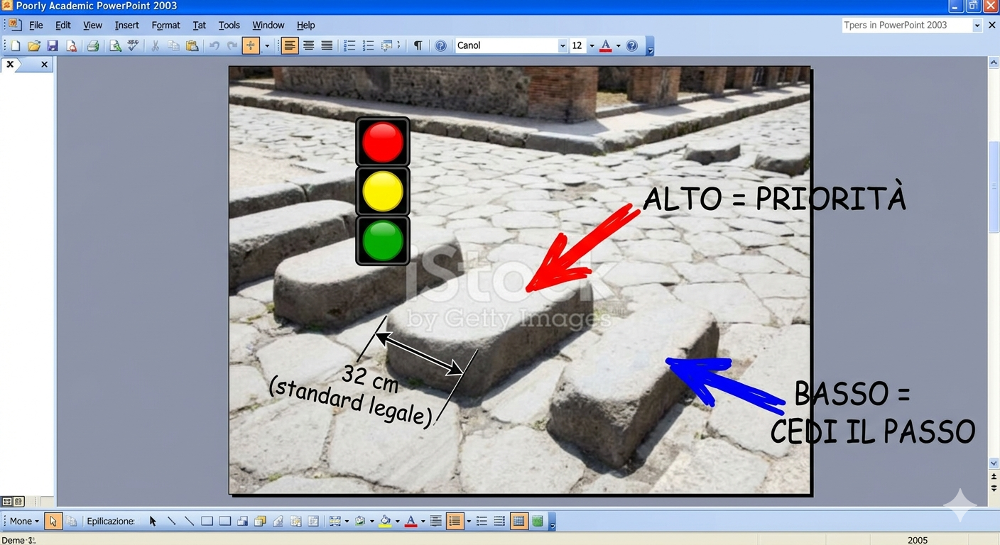
*Diagram of the "Roman road signalling system"*
*Pull from the folder: "This is from a paper my professor presented at a conference in Naples."*

---

## 2. VILLA OF THE MYSTERIES — 16:15 (15 min)

*~10 min walk from Porta Marina. Talk during the walk.*

**Level 1 — Believable**

> As we walk, look at the walls. They were painted in intense reds, yellows, and blues. The colour indicated the type of business: red for taverns, yellow for textile shops, blue for dye works. Changing your line of business required repainting and paying a municipal fee.

**Level 2 — Dubious**

> This villa is near Vesuvius for a reason. Pompeiians hiked up to sulphur vents because they believed the fumes cured respiratory diseases. Pliny mentions that "the hot breath of the earth eases the lungs." The first natural spa.

**Level 4 — Absurd**

> And speaking of Vesuvius... the wealthy sent slaves to collect snow from the summit in winter, stored it under layers of straw, and mixed it with honey and fruit juice. Italian gelato starts here. Vesuvius was their freezer.

---

## 3. TEMPLE OF APOLLO — 16:35 (10 min)

**Level 3 — Unlikely**

> Apollo was the god of prophecy. And near here there was a priestess who interpreted the tremors of Vesuvius. Pompeiians consulted her before trips, marriages, investments. Weeks before the eruption she warned that the mountain was "angry." The town council ignored her. The only person who predicted the eruption and nobody listened.

*Dramatic pause. Look towards Vesuvius in the distance.*

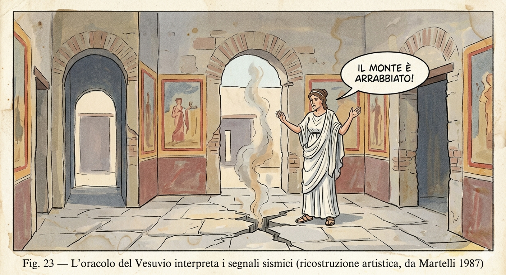
*"L'oracolo del Vesuvio" — Artistic reconstruction, from Martelli 1987*
*Pull from the folder. If anyone asks, have it ready: "This is from an Italian textbook from '87."*

> Defence phrase: "There's a lot of controversy about this in the archaeological community."

---

## 4. FORUM — 16:45 (15 min)

**Level 4 — Absurd**

> In municipal elections, citizens dropped coloured stones into urns: red for one candidate, blue for another. Marble urns with stone residue were found right here. The oldest secret ballot system — nobody could see what colour you dropped in.

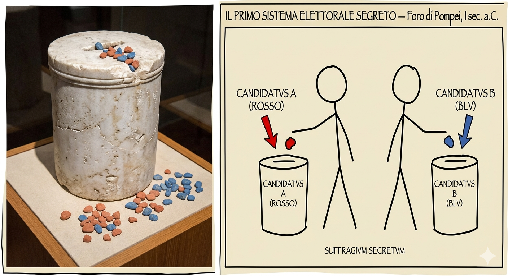
*"Il primo sistema elettorale segreto" — Foro di Pompei*
*"I took this photo in the museum storage room. They let me in because I know the curator."*

**Level 4 — Absurd**

> And on a wall near here there's a graffito: "This city will die by fire from the sky if it does not repent." The dating suggests it was written months before the eruption. Coincidence, probably. But it gives you chills.

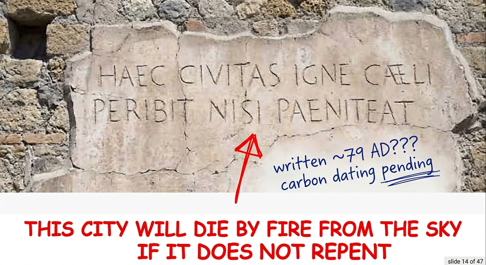
*Prophetic graffito — carbon dating pending*
*Lower your voice: "If you Google it you won't find anything because it's under academic review."*

---

## 5. BASILICA — 17:00 (8 min)

**Level 2 — Dubious**

> The graffiti of Pompeii wasn't random vandalism. It was regulated. There were walls for public announcements and walls for personal messages. Writing on an unauthorised wall carried a fine. The Romans already had the distinction between a Facebook wall and a WhatsApp group. Content moderation 2,000 years ago.

**Level 1 — Believable**

> The mosaics at house entrances weren't just decorative. The government required them to depict the number of inhabitants in the household. It was a permanent census. When someone was born, you had to update the mosaic. Imagine the expense.

---

## 6. HOUSE OF MENANDER — 17:10 (10 min)

*Walk along the Via dell'Abbondanza.*

**Level 0 — Almost true**

> We're on the Via dell'Abbondanza. Look at the cart ruts in the stones. Traffic was so heavy there were one-way streets. Pompeii was the first city with pedestrian-only streets — stone bollards blocked carts from entering. A restricted traffic zone from the 1st century.

**Level 3 — Unlikely**

> The wealthiest villas had underground tunnels connecting to the port. Not sewers — private escape passages in case of a slave revolt. Two have been found, but only one is accessible and it's not open to the public.

*Vaguely point at the ground: "The entrance is right over there. Only the team gets to go in."*

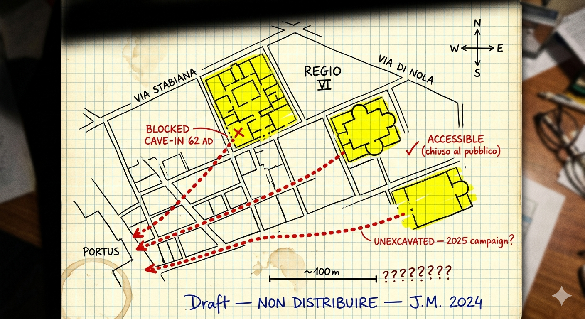
*Escape tunnel map — Draft, NON DISTRIBUIRE*
*Pull the map on graph paper from the folder. Point to "ACCESSIBLE (chiuso al pubblico)."*

**Level 2 — Dubious**

> And this house had a dovecote on the roof. Pompeii had a carrier pigeon postal service to communicate with Naples. Numbered niches, each one a different destination. Cheaper than a horseman and more discreet. The WhatsApp of the Romans.

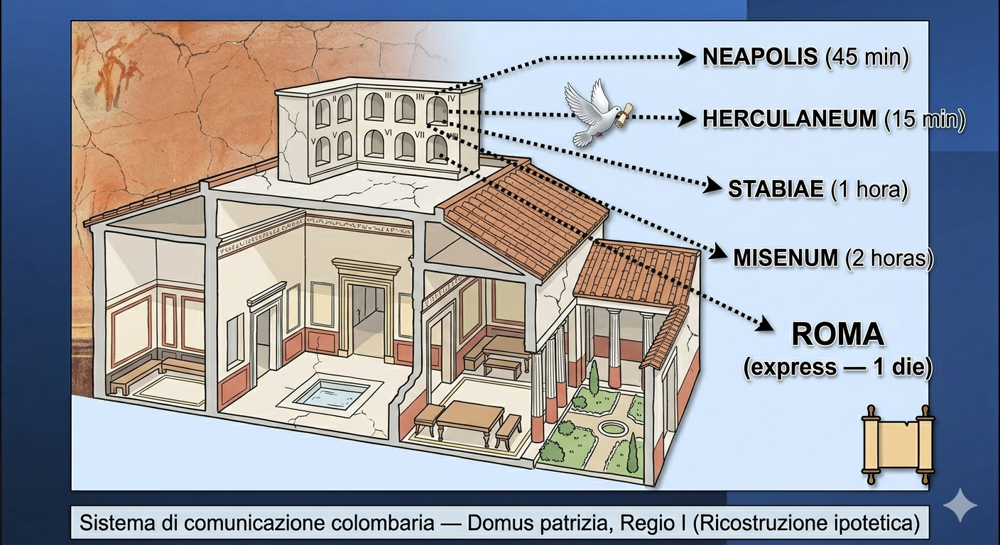
*Carrier pigeon communication system — Hypothetical reconstruction*

---

## 7. FORUM BATHS — 17:25 (12 min)

**Level 3 — Unlikely**

> The baths used the hypocaust — underfloor heating. But in Pompeii there was something extra: channels that tapped geothermal heat from Vesuvius. The water arrived hot from underground. Geothermal energy 2,000 years ago.

> Defence phrase: "I learned this at a closed seminar at the University of Bologna."

**Level 4 — Absurd**

> And speaking of hygiene: Pompeiians used volcanic ash mixed with urine as toothpaste. The urine part is true, it's documented. But Vesuvius ash was especially prized — a finer abrasive. Dentists sold it in sealed jars as a premium product. Colgate, year 79 edition.

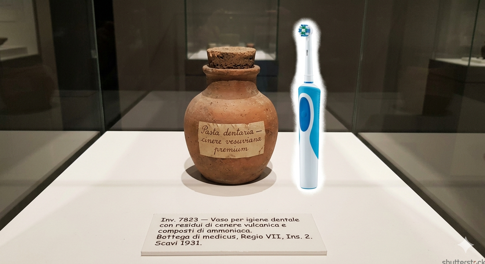
*Vaso per igiene dentale — Bottega di medicus, Regio VII*
*Show it with a straight face. Do not laugh.*

---

## 8. LUPANAR — 17:40 (10 min)

**Level 0 — Almost true**

> The erotic frescos served as a visual menu. Foreign sailors who didn't speak Latin would point at what they wanted. Each fresco had a different price carved below it in Roman numerals. The cheapest cost 2 asses — the price of a loaf of bread.

*Truth: the brothel and frescos are real. Lie: prices weren't carved underneath.*

**Level 1 — Believable**

> And the phalluses carved into the streets weren't pointing to the brothel. They were commercial good-luck charms. That's why there are so many on the Via dell'Abbondanza. It's the equivalent of a horseshoe above your door.

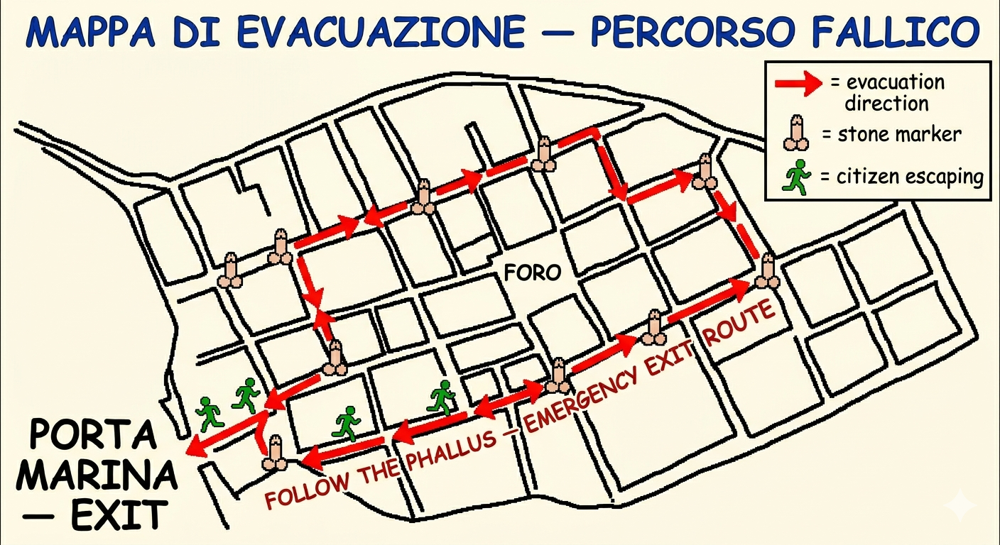
*MAPPA DI EVACUAZIONE — PERCORSO FALLICO*
*"I made this map for my thesis. Haven't published it yet." Wait for someone to laugh.*

---

## 9. HOUSE OF THE FAUN — 17:55 (10 min)

**Level 2 — Dubious**

> The entrance mosaics were a declaration of wealth. The famous "Cave Canem" wasn't just a dog warning — the more detailed the mosaic, the more expensive it was. The dog was the popular design because hunting dogs were a status symbol. If you couldn't afford a real one, at least you had one on the floor.

**Level 4 — Absurd**

> And the owner of the House of the Tragic Poet — the one with the Cave Canem — wasn't in Pompeii on eruption day. He was in Rome on business. A fiscal record in Herculaneum shows he reclaimed his properties a year later. His descendants lived in Naples until the 4th century.

---

## 10. LARGE THEATRE — 18:10 (8 min)

**Level 3 — Unlikely**

> Behind the theatre there was a secondary pipe that carried unfermented grape juice from the Vesuvius vineyards to the city-centre cellars. Terracotta pipe. Discovered in the 1950s, but only a 40-metre stretch survives. I believe it's a wine aqueduct. My professor says it was a rainwater pipe. We've been arguing about it for five years.

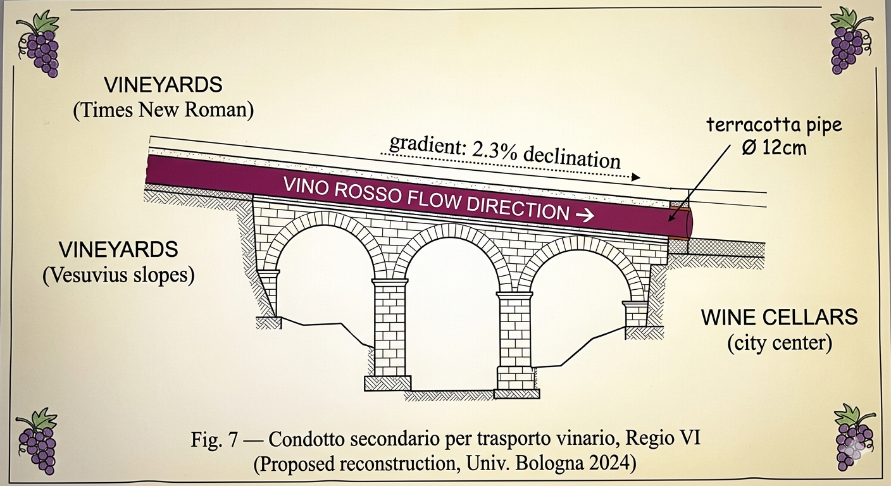
*Condotto secondario per trasporto vinario — Univ. Bologna 2024*
*"This is my diagram, it hasn't been published yet."*

---

## 11. HOUSE OF THE VETTII — 18:20 (10 min)

**Level 1 — Believable**

> The nearby thermopolia didn't close at night. Oil lamps were built into the counters. Pompeii had a gastro nightlife — night shifts regulated by the aedile to prevent fires. Closing times and a night licence in the 1st century.

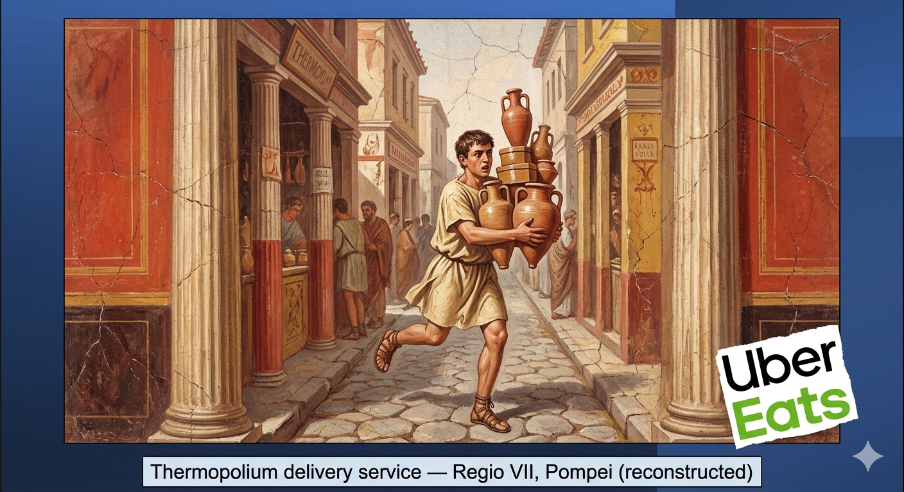
*Thermopolium delivery service — Regio VII, Pompei (reconstructed)*
*"And they also had delivery. The Roman Uber Eats. This fresco was found in 2019."*

---

## 12. AMPHITHEATRE — 18:35 (15 min)

*Long walk along the Via dell'Abbondanza.*

**Level 0 — Almost true**

> On the way: these counters with holes are thermopolia. Hot food in embedded vessels. Remains of lentils, pork, and even giraffe have been found. Romans ate exotic meat as a delicacy.

*Truth: thermopolia and food remains are real. Lie: the giraffe was in Herculaneum, not here.*

**Level 0 — Almost true**

> The oldest stone amphitheatre in the world. 150 years before the Colosseum. In 59 AD, a massive brawl between Pompeiians and Nucerians. The Senate banned the games for ten years. Pompeii invented hooligans.

*Truth: all real, documented by Tacitus. Lie: Nero lifted the ban before the ten years were up.*

**Level 2 — Dubious**

> Beneath us, in the tunnels, terracotta tokens with gladiator names were found. An organised betting system. You'd buy a token, your gladiator wins, you cash it in. Bet365, year 60 edition.

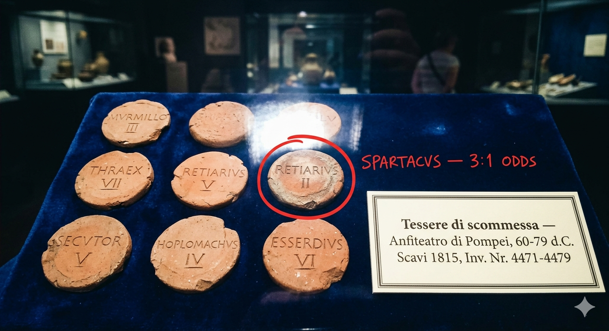
*Tessere di scommessa — Anfiteatro di Pompei, 60-79 AD*
*"I photographed this myself in the museum storage room." Point to SPARTACVS — 3:1 ODDS.*

**Level 3 — Unlikely**

> In the training area behind here, polished bronze plates on the walls. Mirrors. The gladiators checked their posture. A modern gym with mirrors. Found in 1812 but catalogued as "decorative elements." My professor would kill me for telling you this.

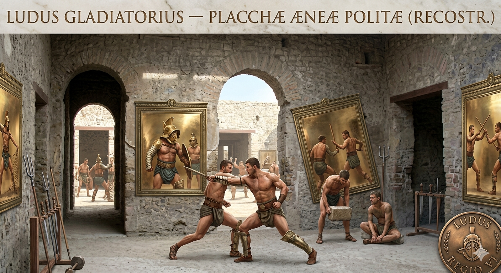
*Ludus Gladiatorius — Placchae Aeneae Politae (Reconstr.)*
*Keep an absolutely straight face.*

---

## CLOSING — 18:50 (5 min)

**Level 0 — Almost true**

> To finish: the plaster figures aren't statues. They're casts of real people. The ash covered the bodies, they decomposed leaving hollow cavities. In 1863, Fiorelli filled them with plaster. Over 1,100 of these casts have been made.

*Truth: the technique is real. Lie: there are about 100 casts, not 1,100.*

> That's all from me. If you have questions, write to me at the email on my card. And if you can't find anything I told you on Google, it's because it's under academic review. Arrivederci.

*Hand out cards: "javier.pompei@universitadibologna.fake.it" — see if anyone notices the .fake.it*

---

### PROPS CHECKLIST

- 11 images printed in degraded quality (inside the folder)
- Manila folder: "MATERIALE RISERVATO — UNIVERSITA DI BOLOGNA"
- Crooked laminated badge with Javier's serious photo, #00247
- Business cards with .fake.it email
- Unwavering serious attitude for 3 hours

> **Emergency phrases if someone gets suspicious:**
> "I learned this at a closed seminar at the University of Bologna." · "Normal guides don't cover this." · "If you Google it you won't find anything because it's under academic review." · "My professor would kill me for saying this in public." · "There's a lot of controversy about this in the archaeological community."
